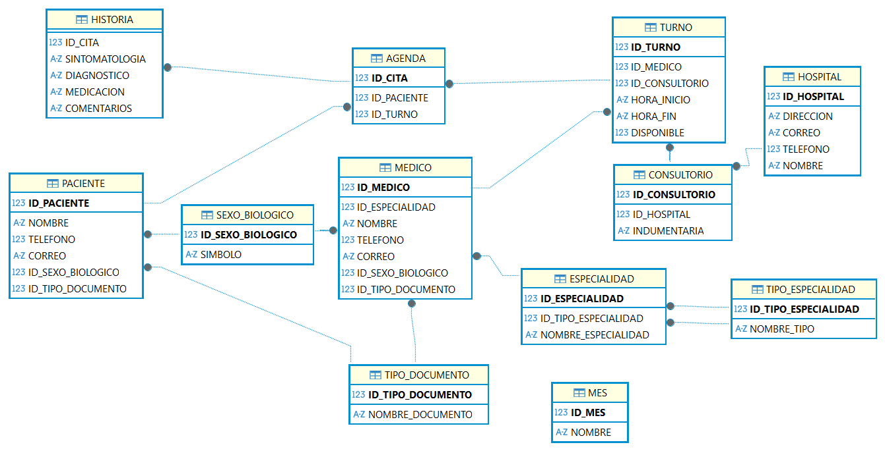
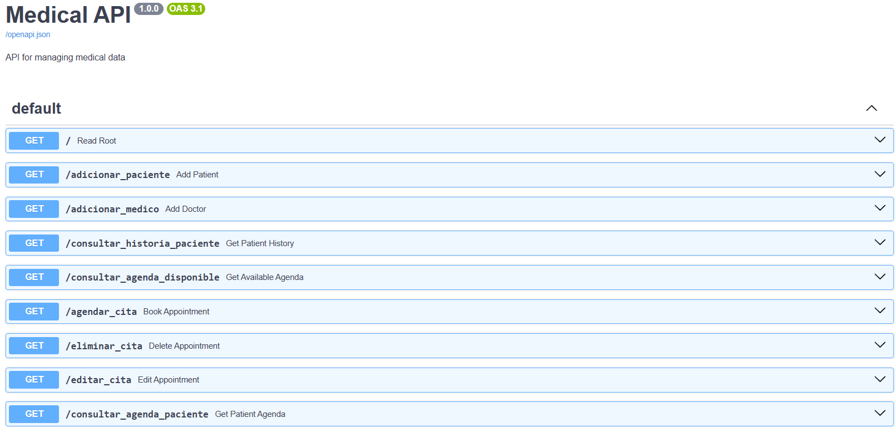
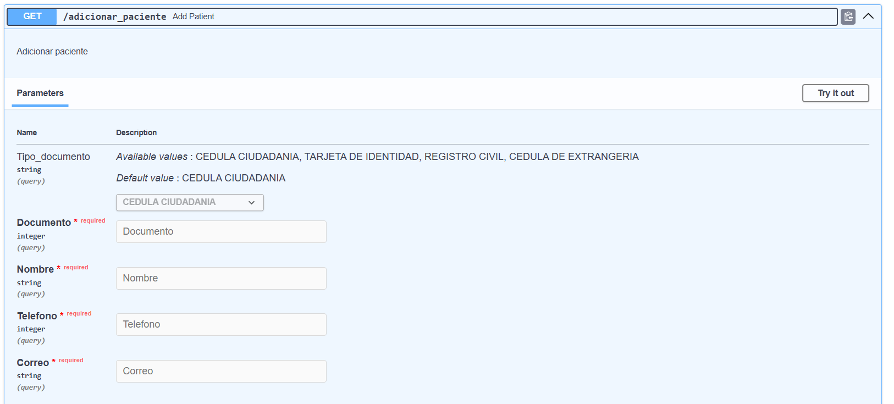
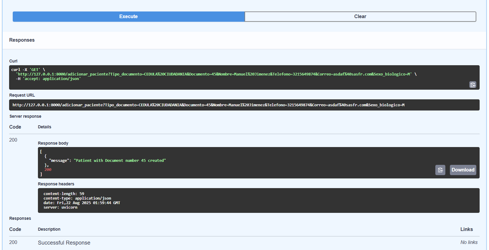
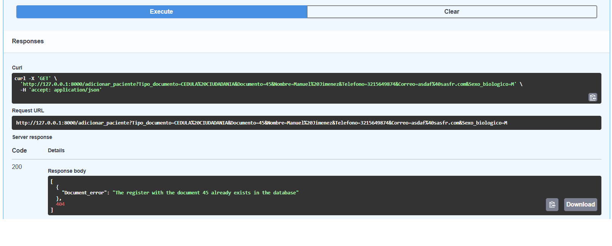

<hgroup>
<h1>Environment instructions and initial setup</h1>
<h2>Installing python, dependencies and launching server</h2>
</hgroup>

<ul>
<li>Clone the repo with <code>git clone https://github.com/gamug/medical-app.git</code></li>
<li>Set up an environment of python 3.12.4. With conda you can proceed
<code>conda create -n u3-project python==3.12.4</code>
<code>conda activate u3-project</code></li>
<li>Place the cmd in the project folder. Install the requirements using the command:
<code>pip install -r requirements.txt</code></li>
<li>Once you finish the environment setup, run the command to raise the API server
<code>uvicorn main:app --reload</code></li>
<li>Then, visit the URL http://127.0.0.1:8000/docs# to get into the swagger interface that let you interact with the backend</li>
</ul>

<hgroup>
<h1>Database description</h1>
<h2>ER diagram</h2>
</hgroup>

<hgroup>
<h2>Database description and requirements</h2>
</hgroup>

The database was designed to operates under real conditions providing the following inputs:
<ul>
<li><b>Patients registered in <code>PACIENTE</code> table:</b> The patients should be register using the functionality provided in the swagger interface in the table.</li>
<li><b>Doctors registered in <code>MEDICO</code> table:</b> The data should include Doctor specialty, name, phone, email, biological sex and identity document.</li>
<li><b>List of hospitals that provide services to the health care entity placen in <code>HOSPITAL</code> table:</b> There are a couple of fields that should be provided (as we can see in the ER figure).</li>
<li><b>List of surgeries under each hospital with a brief description of the stuff located in each room:</b> This data should be locate in <code>CONSULTORIO</code> table.</li>
<li><b>Work plan for each doctor placed in the table <code>TURNO</code>:</b> Each row of the table is an available appointment to distributes along the patients. As we can see in the ER diagram, the table data includes: doctor, surgery (tied to the hispital by the table <code>CONSULTORIO</code>), datetime when appointment starts and ends (in the format <code>YYYY-MM-DDThh:mm</code>) and, last but not least, the availability of the appointment which initially must be True (set as <code>TRUE</code> by default).</li>
</ul>

<hgroup>
<h2>Other tables</h2>
</hgroup>

<ul>
<li><b>Table <code>AGENDA</code>:</b> Linked with the table <code>TURNO</code> by the column <code>ID_TURNO</code>, relates the patient with the doctor appointment.</li>
<li><b>Table <code>HISTORIA</code>:</b> Places the patient clinical history. The idea of this table is to be edited each time a patient has an appointment with a doctor. Is related with the table <code>AGENDA</code> by the column <code>ID_CITA</code>.</li>
<li><b>Table <code>SEXO_BIOLOGICO</code>:</b> This is a support table that places the available biological sex convention (F: Female, M: Male).</li>
<li><b>Table <code>TIPO_DOCUMENTO</code>:</b> This is a support table that provide the available documents (Tarjeta de identidad, cédula de ciudadanía, registro civil, etc).</li>
<li><b>Tables <code>ESPECIALIDAD</code> and <code>TIPO_ESPECIALIDAD</code>:</b> This tables provides support for the <code>MEDICO</code> table. They let setup the specialty of the doctor.</li>
<li><b>Table <code>MES</code>:</b> Months of the year.</li>
</ul>

<hgroup>
<h1>Swagger description</h1>
<h2>General overview</h2>
</hgroup>

<hgroup>
<h2>Swagger basic usage</h2>
</hgroup>

To use swagger interface click in the desired functionality to expand the menu:

In the previous image you can find the expanded menu and a partial overview of the inputs for the <code>add_patient</code> functionality. Once you're in the menu you need to click on "Try it out" upper right button to start the functionality interaction.

You need to provide all the field marked as "required" with the proper data type specified in the schema and placed in each field (for example: Tipo_documento is a required field of the type integer). The coolest thing of FastApi backend interface is that provide data type validators that operates without developer setup, just specifying the types in the functions in <code>main.py</code> script.

Once you fill the fields with the correct data you must click on "execute" button bellow of the formulary shown in previous image. The result (if you fill correctly the data) should look like following image:

Note that the code returned by the function follows the HTML convention (in this case is a 200 code as the running was successfully finished). In case that there are business errors in the provided data in the formulary, the code are equipped with internal validations that check basic stuff (for example, the id provided to register in <code>PACIENTE</code> table is not currently in the database) and provides all found errors at the time. The following image show this clearly.

<hgroup>
<h2>Swagger functionality description</h2>
</hgroup>

<h3>"/"</h3>
Returns the swagger default response as a json containing a link to the swagger #docs <code>{"Medical API": "This is the main page for the medical app. To access the swagger enter to the URL http://127.0.0.1:8000/docs#/"}</code>
<h3>"/adicionar_paciente"</h3>
Let the user add a patient to the database. The formulary has the following inputs:
<ul>
<li><b>Tipo_documento: </b>String required. Dropdown list containing the document types.</li>
<li><b>Documento: </b>Integer required. Text box that get the document ID for the patient.</li>
<li><b>Nombre: </b>String required. Text box that inputs the name of the patient.</li>
<li><b>Telefono: </b>Integer required. Text box that inputs the phone of the patient.</li>
<li><b>Correo: </b> String required. Text box that inputs the email of the patient. Should be in the format <code>[a-z0-9_]+@[a-z0-9_]+\.com</code> otherwise the validation raises and error.</li>
<li><b>Sexo_biologico: </b>String required. Dropdown list containing the biological sex convention (F: Female, M. Male).</li>
</ul>
<h3>"/adicionar_medico"</h3>
Let user add a doctor to the database. The formulary has the following inputs:
<ul>
<li><b>Tipo_documento: </b>String required. Dropdown list containing the document types.</li>
<li><b>Documento: </b>Integer required. Text box that get the document ID for the doctor.</li>
<li><b>Especialidad: </b> String required. Dropdown list containing the possible doctor specialties.</li>
<li><b>Nombre: </b>String required. Text box that inputs the name of the doctor.</li>
<li><b>Telefono: </b>Integer required. Text box that inputs the phone of the doctor.</li>
<li><b>Correo: </b> String required. Text box that inputs the email of the doctor. Should be in the format <code>[a-z0-9_]+@[a-z0-9_]+\.com</code> otherwise the validation raises and error.</li>
<li><b>Sexo_biologico: </b>String required. Dropdown list containing the biological sex convention (F: Female, M. Male).</li>
</ul>
<h3>"/consultar_historia_paciente"</h3>
Query the database searching for patient history. Remember that patient history is only available when the patient already has been in any appointment. This functionality only has a single input which is the patient ID (Documento field Integer required). In case the database query doesn't return any result the functionality raises an error with the message <code>[{"message": "No records found for patient"}, 404]</code>. In case that the query return any results the code launch a HTML view containing a table with the patient clinical history.
<h3>"/consultar_agenda_disponible"</h3>
Filter database to know the available agenda. In case that the query return any results the code launch a HTML view containing a table with the available agenda filtered by the fields provided. The fields to filter are:
<ul>
<li><b>Nombre_medico: </b>String optional. Text box that inputs the name of the doctor.</li>
<li><b>Mes_cita: </b> String optional. Dropdown list containing the month in which the appointment will happen.</li>
<li><b>Especialidad_medico: </b> String optional. Dropdown list containing the possible doctor specialties.</li>
<li><b>Sexo_biologico_medico: </b>String optional. Dropdown list containing the biological sex convention (F: Female, M. Male).</li>
<li><b>Hospital_atencion: </b> String optional. Dropdown list with the full available hospital to take appointments.</li>
</ul>
<h3>"/consultar_agenda_doctor"</h3>
Filter database to know the doctor agenda. In case that the query return any results the code launch a HTML view containing a table with the doctor agenda filtered by the fields provided. This is only provided by the took appointments. The fields to filter are:
<ul>
<li><b>Nombre_medico: </b>String optional. Text box that inputs the name of the doctor.</li>
<li><b>Mes_cita: </b> String optional. Dropdown list containing the month in which the appointment will happen.</li>
<li><b>Especialidad_medico: </b> String optional. Dropdown list containing the possible doctor specialties.</li>
<li><b>Sexo_biologico_medico: </b>String optional. Dropdown list containing the biological sex convention (F: Female, M. Male).</li>
<li><b>Hospital_atencion: </b> String optional. Dropdown list with the full available hospital to take appointments.</li>
</ul>
<h3>"/agendar_cita"</h3>
Let the user book an appointment reserving the space to the patient specified. This functionality add a register in the table <code>AGENDA</code> and update the table <code>TURNO</code> to set column <code>DISPONIBLE</code> to false, so any other patient could take that appointment. This functionality has the following fields:
<ul>
<li><b>Documento_paciente: </b>Integer required. Text box with the patient document.</li>
<li><b>Id_turno: </b> Swift ID to reserve the doctor agenda space. This swift ID must be related with the column <code>ID_TURNO</code> of the table <code>TURNO</code></li>
</ul>
<h3>"/eliminar_cita"</h3>
This functionality let user delete an patient appointment. The unique parameter is the Swift ID to reserve the doctor agenda space. This swift ID must be related with the column <code>ID_TURNO</code> of the table <code>TURNO</code>
<h3>"/editar_cita"</h3>
Using this functionality modifies previous swift ID and set a new one to the same patient. Is, basically, a change of <code>ID_TURNO</code> in the <code>AGENDA</code> table with the corresponding setup in the <code>TURNO</code> table (making previous id available an setting new one unavailable). This functionality is tied to the same validations as "/agendar_cita". The formulary has the following fields:
<ul>
<li><b>Id_turno_viejo: </b>Integer requiered. Text box to introduce booked appointment swift ID.</li>
<li><b>Id_turno_nuevo: </b>Integer requiered. Text box to introduce the new swift ID that will replaces the old one.</li>
</ul>
<h3>"/consultar_agenda_paciente"</h3>
Let user know previous and coming patient appointments. This functionality only has a simple input field "Documento_paciente" (Integer required input by a text box). In case that the query return any results the code launch a HTML view containing a table with the patient appointment history.

<hgroup>
<h1>Next steps and further improvements</h1>
</hgroup>
<ul>
<li>Develop the functionality to delete patients</li>
<li>Develop the functionality to erase doctors</li>
<li>Develop the functionality to edit the medical history once the doctor has the appointment.</li>
<li>Build an user interface (UI/UX work)</li>
</ul>